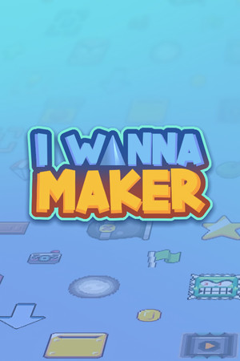
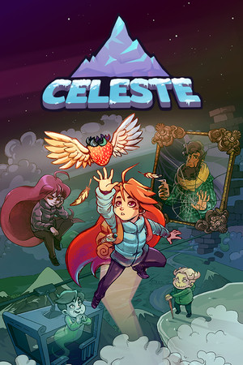
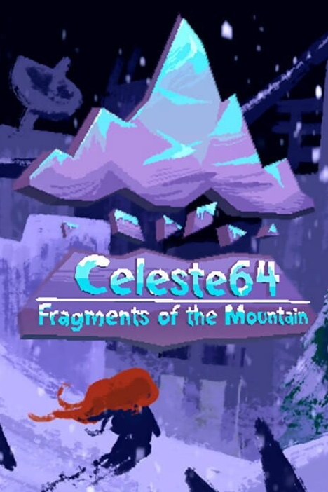
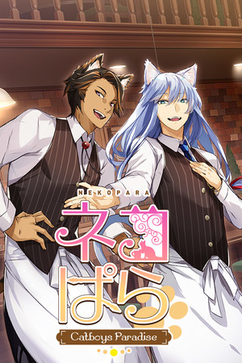

I translate video games as a hobby.

---

## Translated Games

    

        
        Official
        <a href="https://store.steampowered.com/app/1114940/I_Wanna_Maker/" target="_blank" class="game-title-link">I Wanna Maker</a>
    

    

        
        Unofficial
        <a href="https://github.com/lDMDiamondl/CelesteKRPatch/releases/latest" target="_blank" class="game-title-link">Celeste</a>
    

    

        
        Unofficial
        <a href="https://drive.google.com/file/d/1WiqUXRZdnliDlao40iN5-P9k9LZOk9B0" target="_blank" class="game-title-link">Celeste 64</a>
    

    

        
        Unofficial
        <a href="https://drive.google.com/file/d/1jt1TiyN1zZepCjzhJOm3iNOS-cQaFgMg" target="_blank" class="game-title-link">NEKOPARA - Catboys Paradise</a>
    

